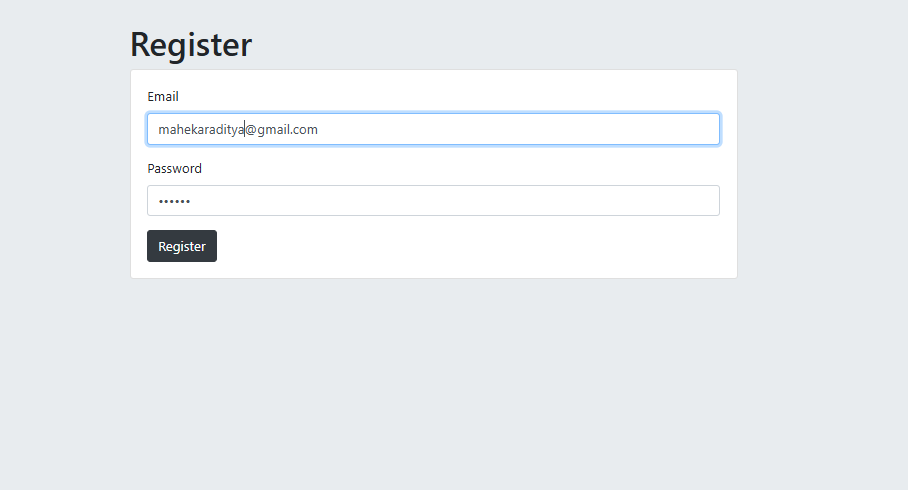
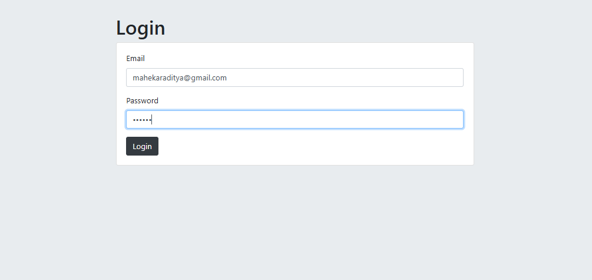
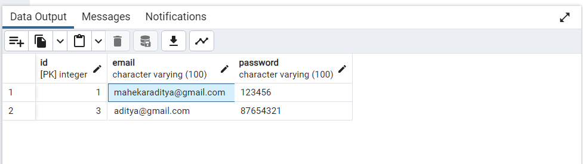

# 🔐 Login & Register Page – Level 1 Authentication

This project is a basic authentication system built with Node.js, Express, EJS, and PostgreSQL.
It demonstrates Level 1 Authentication (using email & password without hashing/encryption).
---

## 📷 Gallery

| UI | To-do List |
|----|------------|
|  |  |

| Add To-do List | Edit To-do List |
|----------------|-----------------|
|  |  |

| Delete To-do List | 
|-------------------|
|  |

---

## ⚙️ Setup Instructions

 1️⃣ Create Table in PostgreSQL(users):
 <br><br>
as given in the query.sql
 <br>
 
2️⃣ Install Dependencies:
```bash
npm i
npm i pg express ejs body-parser
```

3️⃣ Database Connection (index.js)
```bash
const app = express()
const db = new pg.Client({
  user: "postgres",
  host: "localhost",
  database: "XXXXX",    // <-- your database name
  password: "XXXXX",    // <-- your password
  port: XXXX,           // <-- your port name, by default for pg 5432
});
```
4️⃣ Run Server:
```bash
node index.js
```
---
👉 [Open App on Localhost](http://localhost:3000)
