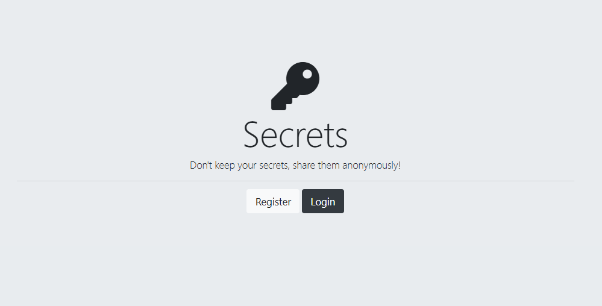

# 🔐 Login & Register Page – Level 1 Authentication

This project is a basic authentication system built with Node.js, Express, EJS, and PostgreSQL.  
It demonstrates Level 1 Authentication (using email & password without hashing/encryption).

---
The project follows a modular EJS structure using partials (header.ejs, footer.ejs) and serves static assets through the public/ folder.<br>

---

🔑 Levels of Authentication:<br>
Level 1: Basic Cipher (Caesar, Hill, Playfair, etc.)<br>
Level 2: Hashing (MD5, SHA, etc.)<br>
Level 3: Hashing + Salt Rounds (bcrypt)<br>
Level 4: Session-Based Authentication (bcrypt + Passport.js + Cookies ✅ this project)<br>


---
📂 Project Structure:<br><br>
Authentication+Lv.1<br>
│── css/<br>
│   └── styles.css          <br>
│<br>
│── public/<br>
│   └── styles.css         <br>
│<br>
│── partials/<br>
│   ├── footer.ejs           e<br>
│   └── header.ejs          <br>
│<br>
│── views/<br>
│   ├── home.ejs             <br>
│   ├── login.ejs           <br>
│   ├── register.ejs        <br>
│   ├── secrets.ejs          <br>
│<br>
│── index.js                <br>
│── package.json            <br>
│── package-lock.json       <br>


---

## 📷 Gallery

| SignUp Page | Login Page|
|----|------------|
|  | |

| Register Page| Secret Page|
|----------------|-----------------|
|   |  |

| DataBase | 
|-------------------|
|  |

---

## ⚙️ Setup Instructions

 1️⃣ Create Table in PostgreSQL(users):
 <br><br>
as given in the query.sql
 <br>
 
2️⃣ Install Dependencies:
```bash
npm i
npm i pg express ejs body-parser
```

3️⃣ Database Connection (index.js)
```bash
const app = express()
const db = new pg.Client({
  user: "postgres",
  host: "localhost",
  database: "XXXXX",    // <-- your database name
  password: "XXXXX",    // <-- your password
  port: XXXX,           // <-- your port name, by default for pg 5432
});
```
4️⃣ Run Server:
```bash
node index.js
```
---
👉 [Open App on Localhost](http://localhost:3000)
